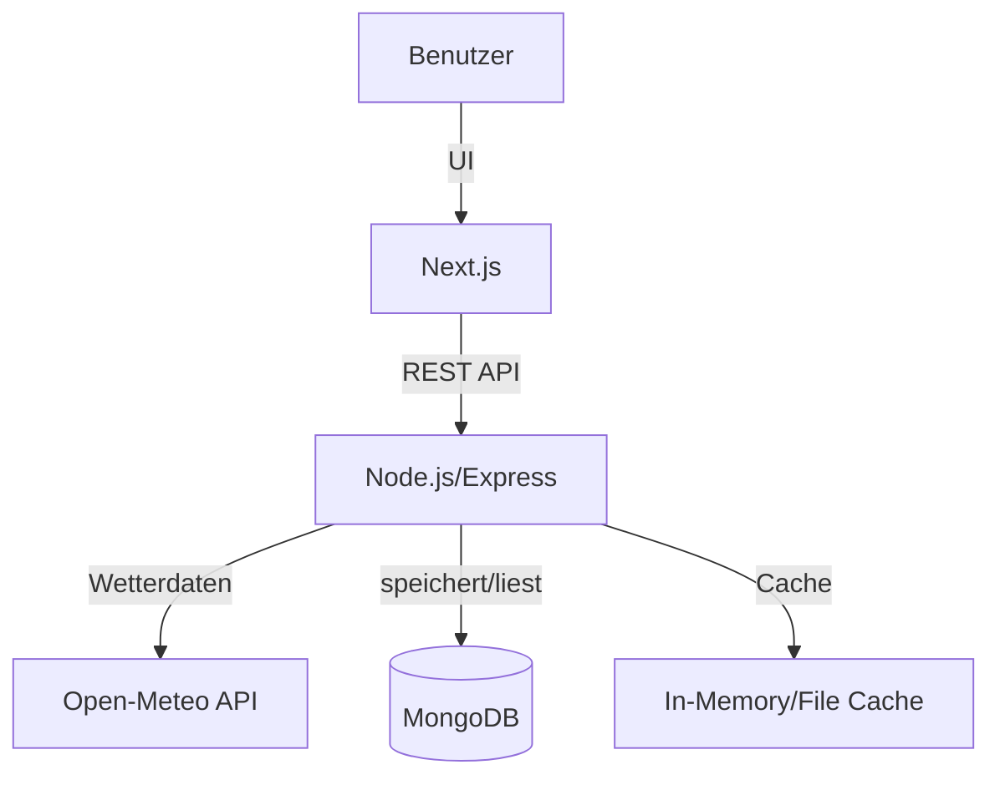

## 🚀 Setup-Anleitung

### Voraussetzungen

- Node.js (v18+ empfohlen)
- MongoDB (lokal oder über MongoDB Atlas)
- NPM oder Yarn

### 1. Backend starten

```bash
cd server
npm install
npm run dev
```

> 💡 Beispiel `.env`-Datei:

```env
MONGODB_URI=your-mongodb-atlas-connection
PORT=5000
```

### 2. Frontend starten

```bash
cd client
npm install
npm run dev
```

> 💡 Standardmäßig läuft das Frontend unter `http://localhost:3000`
> 💡 Das Backend sollte unter `http://localhost:5000` erreichbar sein

---

## 🧾 API-Beschreibung

Das Backend stellt eine einfache REST-API bereit, um Wetter-Widgets zu verwalten. Die wichtigsten Endpunkte sind:

| Methode | Endpoint       | Beschreibung                        |
| ------- | -------------- | ----------------------------------- |
| GET     | `/widgets`     | Liste aller gespeicherten Widgets   |
| POST    | `/widgets`     | Neues Widget erstellen (`location`) |
| DELETE  | `/widgets/:id` | Widget löschen                      |

**Beispiel-Request für ein neues Widget:**

```http
POST /widgets
Content-Type: application/json

{
	"location": "Berlin"
}
```

**Antwort:**

```json
{
  "_id": "...",
  "location": "Berlin",
  "weather": {
    "temperature": 22,
    "description": "Klarer Himmel"
  }
}
```

---

## 🏗️ Architekturüberblick

```txt
/Wetter-Widgets
├── client/   → Next.js Frontend (Dashboard)
│   ├── src/app/
│   ├── src/components/
│   └── src/utils/
├── server/   → Node.js Backend (Express)
│   ├── src/routes/
│   ├── src/controllers/
│   ├── src/models/
│   ├── src/services/   → Wetterdaten-Logik inkl. Caching
│   └── src/cache/      → In-Memory oder File-basierter Cache
└── README.md
```

**Ablauf:**

- Das Frontend (Next.js) kommuniziert mit dem Backend über eine REST-API.
- Das Backend verwaltet die Widgets und ruft Wetterdaten von Open-Meteo ab.
- Wetterdaten werden für 5 Minuten gecached, um unnötige API-Requests zu vermeiden.
- Die Daten werden in einer MongoDB gespeichert.

**Diagramm:**



---

## ☁️ Wetterdaten-API

Die Anwendung nutzt die kostenlose Open-Meteo API:

- [https://open-meteo.com/](https://open-meteo.com/) (kein API-Key nötig)

---

## 🧪 Ziel des Projekts

- Verständnis für API-Design, Next.js-Frontend und Microservice-Architektur
- Umgang mit externen APIs und Caching
- MongoDB-Datenmodellierung
- Trennung von Backend-Logik und Frontend-Komponenten
- Saubere Code-Struktur, Modularität und Dokumentation
