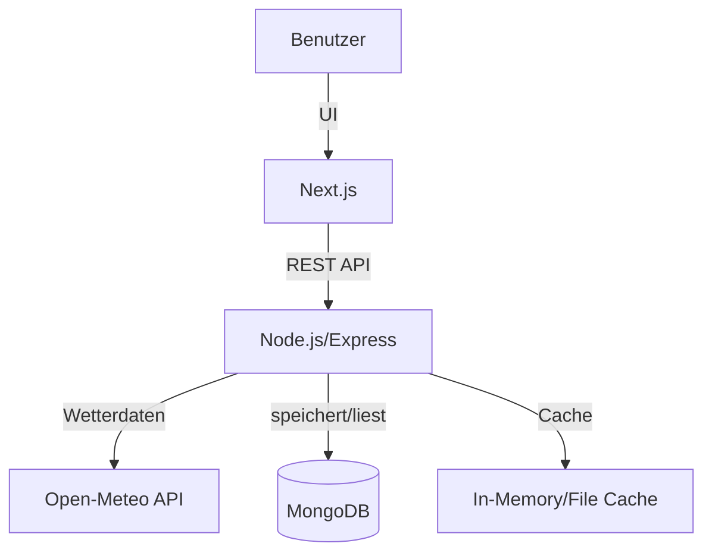

## 🚀 Setup-Anleitung

### Voraussetzungen

- Node.js (v18+ empfohlen)
- MongoDB Atlas
- NPM

### 1. Backend starten

```bash
cd server
npm install
npm run dev
```

> 💡 Beispiel `.env`-Datei:

```env
MONGODB_URI=your-mongodb-atlas-connection
PORT=5000
```

### 2. Frontend starten

```bash
cd client
npm install
npm run dev
```

> 💡 Beispiel `.env`-Datei:

```env
NEXT_PUBLIC_API_BASE_URL=http://localhost:5000
```

> 💡 Frontend unter `http://localhost:3000`
> 💡 Backend unter `http://localhost:5000`

---

## 🧾 API-Beschreibung

Das Backend stellt eine einfache REST-API bereit, um Wetter-Widgets zu verwalten. Die Endpunkte sind:

| Methode | Endpoint       | Beschreibung                        |
| ------- | -------------- | ----------------------------------- |
| GET     | `/widgets`     | Liste aller gespeicherten Widgets   |
| POST    | `/widgets`     | Neues Widget erstellen (`location`) |
| DELETE  | `/widgets/:id` | Widget löschen                      |

**Beispiel-Request für ein neues Widget:**

```http
POST /widgets
Content-Type: application/json

{
	"location": "Berlin"
}
```

**Antwort:**

```json
{
    "_id": "68a528219b10fb5466680b17",
    "location": "Berlin",
    "createdAt": "2025-08-20T01:42:57.181Z",
    "__v": 0,
    "weather": {
        "temperature": 17,
        "description": "Clear sky"
    }
},
```

---

## 🏗️ Architekturüberblick

```txt
/Wetter-Widgets
├── client/                  → Next.js Frontend (Dashboard)
│   ├── public/
│   ├── src/
│   │   ├── app/
│   │   │   ├── about/
│   │   │   ├── favicon.ico
│   │   │   ├── globals.css
│   │   │   ├── layout.tsx
│   │   │   └── page.tsx
│   │   ├── components/
│   │   │   ├── Footer.tsx
│   │   │   ├── Header.tsx
│   │   │   └── Widget.tsx
│   │   └── utils/
│   │       ├── autocomplete.ts
│   │       ├── weatherIcon.tsx
│   │       └── widgetApi.ts
│   ├── package.json
│   ├── tsconfig.json
│   └── ...
├── server/                  → Node.js Backend (Express)
│   ├── src/
│   │   ├── app.ts
│   │   ├── cache/
│   │   │   └── weatherCache.ts
│   │   ├── config/
│   │   │   └── index.ts
│   │   ├── controllers/
│   │   │   └── wetterWidgetController.ts
│   │   ├── db/
│   │   │   └── index.ts
│   │   ├── middleware/
│   │   │   └── errorHandler.ts
│   │   ├── models/
│   │   │   └── Widget.ts
│   │   ├── routes/
│   │   │   └── wetterWidgetRouter.ts
│   │   ├── services/
│   │   │   └── index.ts
│   │   └── utils/
│   │       ├── asyncHandler.ts
│   │       └── errorResponse.ts
│   ├── package.json
│   ├── tsconfig.json
│   └── ...
├── README.md
└── ...
```

**Ablauf:**

- Das Frontend (Next.js) kommuniziert mit dem Backend über eine REST-API.
- Das Backend verwaltet die Widgets und ruft Wetterdaten von Open-Meteo ab.
- Wetterdaten werden für 5 Minuten gecached, um unnötige API-Requests zu vermeiden.
- Die Daten werden in einer MongoDB gespeichert.

**Diagramm:**



---

## ☁️ Wetterdaten-API

Die Anwendung nutzt die kostenlose Open-Meteo API:

- [https://open-meteo.com/](https://open-meteo.com/) (kein API-Key nötig)

---
